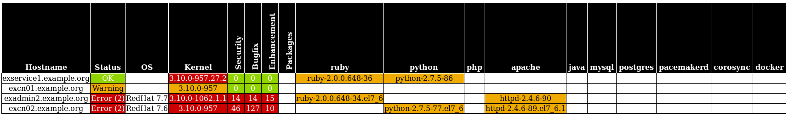

|License|
Satellite HTML report
=====================

INFORMATION
-----------

This is report template for satellite 6.5 host inventory...

It's based on https://www.redhat.com/en/blog/getting-started-satellite-65-reporting-engine

Requirements
------------

Redhat Satellite 6.5+ / Foreman 1.20+

How to use the template
------------------------

1/ Clone this repository:

    # git clone git clone https://github.com/kamedodji/satellite-html-report.git

2/ create template in Satellite 6.5+ / Foreman 1.20+

    # hammer report-template  create --name "Satellite HTML Report Inventory" \
	--file satellite-html-report/export.html.erb --default yes --organization-id 1

3/ You can check now that report template have been correctly imported:

    # hammer report-template list

4/ If previous is OK, generate your report:

    # hammer report-template generate --name "Satellite HTML Report Inventory" \
	| tee /tmp/satellite-html-report.html

It's also possible to launch report only on subset host:

    # hosts=n01
    # hammer report-template generate --name "Satellite HTML Report Inventory" \
	--inputs hosts="name ~ $hosts" | tee /tmp/satellite-html-report.html

It's will report only host(s) which match "n01"....

Screenshot
------------

.. |License| image:: https://img.shields.io/badge/license-GPL%20v3.0-brightgreen.svg
   :target: COPYING
   :alt: Repository License
